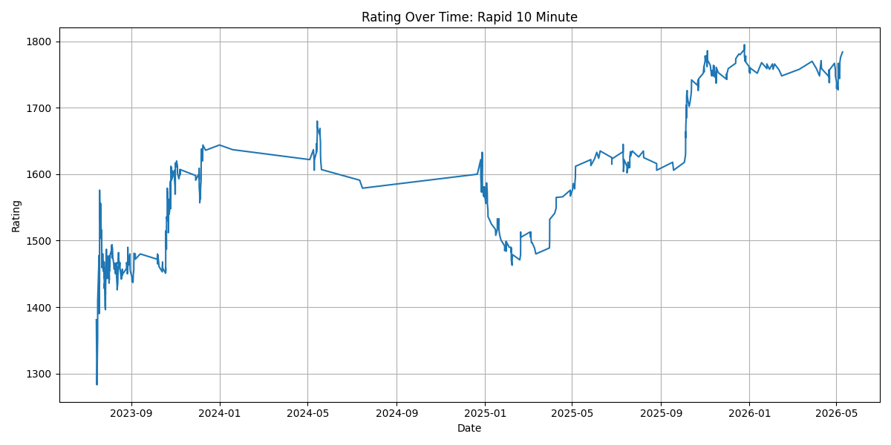
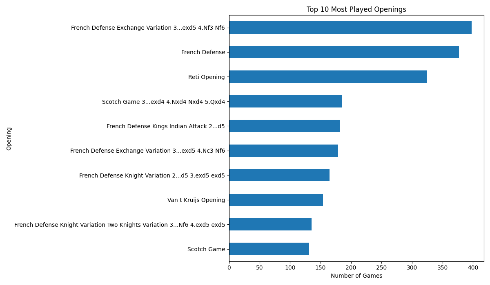
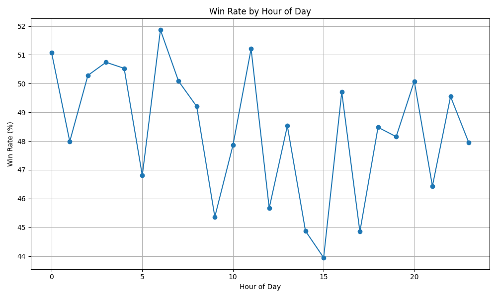

# Chess Performance Dashboard

Interactive data science dashboard analyzing 12,000+ Chess.com games using Python, pandas, Streamlit, and Plotly.

This project uses the Chess.com Public API to collect personal game data and generate visual analytics related to rating progression, opening performance, win rates, and gameplay trends over time.

---

## Features

- Interactive Streamlit dashboard
- Rating progression over time
- Win rate analysis by time of day
- Opening performance analytics
- Most-played opening visualizations
- Time control filtering
- Dynamic Plotly charts and visualizations
- Data cleaning and feature engineering pipeline

---

## Technologies Used

- Python
- pandas
- Streamlit
- Plotly
- Matplotlib
- Chess.com Public API
- Git/GitHub

---

## Dashboard Preview

### Rating Progression

### Most Played Openings

### Win Rate by Hour

---

## Project Structure

chess-performance-dashboard/
- app.py
- README.md
- requirements.txt
- data/
  - chess_games.csv
  - chess_games_cleaned.csv
- outputs/
  - rating_over_time_60.png
  - rating_over_time_180.png
  - rating_over_time_600.png
  - top_openings.png
  - best_openings.png
  - win_rate_by_hour.png
- notebooks/
- src/
  - fetch_chess_games.py
  - clean_games.py
  - analyze_games.py
  - visualize_games.py
  - make_charts.py

---

## Data Pipeline

### 1. Fetch Chess.com Data

Game archives are downloaded using the Chess.com Public API.

Command:

python src/fetch_chess_games.py

### 2. Clean and Engineer Features

Raw game data is cleaned and transformed into analysis-ready datasets.

Command:

python src/clean_games.py

### 3. Generate Analytics and Charts

Visualizations and statistical summaries are generated from the cleaned dataset.

Command:

python src/make_charts.py

### 4. Launch Interactive Dashboard

Command:

streamlit run app.py

---

## Key Insights Explored

- Rating progression over time
- Best and worst openings by win rate
- Win rate by hour of day
- Performance differences across time controls
- Opening usage frequency
- Gameplay trends and consistency

---

## Future Improvements

- Stockfish engine integration
- Blunder and accuracy analysis
- Opening recommendation system
- Session and tilt analysis
- Heatmaps and advanced visualizations
- Public cloud deployment
- Opponent strength analysis
- Machine learning prediction models

---

## Author

Lucas Washor

UIUC Data Science + Information Sciences
